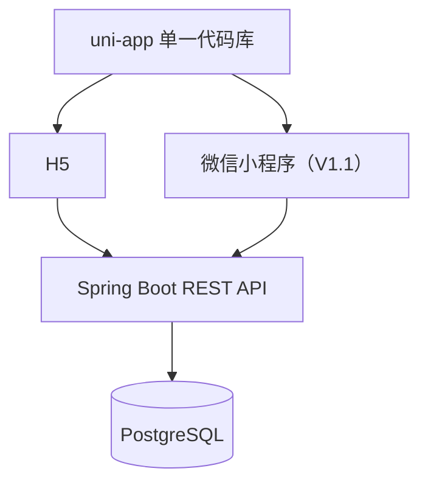

# 育儿日记 App / 小程序 MVP 开发计划

> 版本：V1.0 规划稿  
> 目标：用最小开发成本，在 6～8 个工作日内完成一版可实际使用的 H5 母婴日志工具。  
> 首发端：H5；微信小程序使用同一套 uni-app 代码，在 H5 验收后再适配。

## 1. 项目目标

第一版只解决四件最常用的事情：

1. 录入宝宝出生时间和自定义关键日期，自动计算出生天数、满月、百天等节点。
2. 快速记录喂奶，实时显示距离上一次喂奶多久，以及预计下一次喂奶时间。
3. 快速记录尿尿、便便，并能按时间线查看当天全部记录。
4. 添加一次性待办任务，在应用打开期间进行到期提醒。

第一版采用“单家庭、单宝宝、共享同一套数据”的模式，不做用户体系、成员角色和复杂权限；云服务器部署时使用一个在后端 YAML 中配置的家庭访问密码保护全部接口。数据库与接口保留 `baby_id`，方便后续扩展多宝宝。

### 第一版成功标准

- 手机打开后 10 秒内可以完成一次喂奶或尿便记录。
- 首页能直接看到宝宝日龄、下一个关键节点、上次喂奶间隔、今日尿便次数和今日待办。
- 所有记录均可补录、修改、删除，修改历史记录后间隔会重新计算。
- H5 在手机浏览器完成全流程验收；后端接口继续保持 uni-app 多端兼容。
- 首次打开 H5 时输入家庭访问密码，验证通过后才可读写母婴数据。
- 服务重启后数据不丢失，并具备最基本的数据库备份方式。

## 2. 已确定的 MVP 产品口径

| 项目 | 第一版规则 |
| --- | --- |
| 使用对象 | 单家庭、单宝宝 |
| 登录/鉴权 | 不做账号体系；云部署启用一个 YAML/环境变量配置的家庭访问密码 |
| 首个验收端 | H5；微信小程序延后到 V1.1 |
| 默认时区 | `Asia/Shanghai`，可在设置中修改 |
| 出生时间 | 精确到分钟，前端使用 ISO 8601 带时区格式传输 |
| “出生第几天” | 出生当天算第 1 天 |
| 满月 | 出生时间加 1 个自然月，不按固定 30 天计算 |
| 百天 | 出生当天算第 1 天，因此目标日期为出生日期加 99 天 |
| 喂奶间隔 | 默认按两次喂奶的开始时间计算 |
| 下次喂奶 | 上次开始时间 + 默认间隔；默认 180 分钟，可配置 |
| 母乳亲喂 | 必填左侧/右侧/双侧；奶量允许为空；支持开始/停止计时 |
| 母乳瓶喂 | 奶量必填；乳房侧别可选 |
| 奶粉瓶喂 | 奶量必填；乳房侧别不显示 |
| 尿便类型 | 尿尿、便便、尿便都有 |
| 任务 | 第一版只支持一次性任务；重复任务放到 V1.1 |
| 提醒 | 第一版为 H5 应用内提醒；关闭页面后不承诺系统级推送 |
| 删除 | 采用软删除，避免误删后无法恢复 |

对于“满月”和“百天”的民俗口径，如果家庭习惯不同，后续可以增加一个计算规则开关；第一版先固定上述默认规则。

## 3. 功能范围与优先级

### P0：必须完成

#### 3.1 宝宝资料和关键日期

- 设置宝宝昵称、出生时间、时区。
- 首页显示：出生第 N 天、已出生 N 天 N 小时、当前月龄。
- 自动生成：满月、百天、半岁、周岁。
- 展示关键节点日期、剩余天数或已过去天数。
- 添加、编辑、删除自定义纪念日，包括标题、目标时间、备注。

#### 3.2 喂奶记录

- 三种类型：母乳亲喂、母乳瓶喂、奶粉瓶喂。
- 记录开始时间、结束时间、奶量、左/右/双侧、备注。
- 时间默认当前时间，允许补录历史时间。
- 亲喂支持“开始计时—停止并保存”；应用退到后台后，根据开始时间恢复计时，不依赖计时器持续运行。
- 展示距离上一次喂奶的分钟数。
- 展示预计下一次喂奶时间，以及“还有多久/已超时多久”。
- 今日统计：喂奶次数、瓶喂总毫升、亲喂总分钟。
- 支持列表、详情、编辑、删除。

#### 3.3 尿便记录

- 快捷选择：尿尿、便便、尿便都有。
- 记录发生时间、备注。
- 首页分别显示距离上次尿尿、上次便便的时间。
- 今日统计尿尿次数、便便次数。
- 支持列表、编辑、删除。

#### 3.4 待办任务

- 添加标题、说明、到期时间、提醒时间。
- 状态：待处理、已完成、已取消。
- 首页显示今天到期、即将到期和已超时任务。
- 支持完成、恢复、编辑、删除。
- 应用处于前台时，到提醒时间弹窗、振动或播放简短提示音。
- 每次进入应用时主动检查漏掉的提醒。

#### 3.5 首页和统一时间线

- 首页提供四个区域：宝宝状态、关键节点、快速记录、今日摘要。
- “快速记录”至少包含：开始亲喂、记录瓶喂、记录尿尿、记录便便。
- 时间线合并展示喂奶、尿便、任务完成记录，并按发生时间倒序排列。
- 支持按日期查看历史记录。

### P1：V1.1 再做

- 微信小程序端编译适配和真机验收。
- 每日/每周重复任务。
- 7 天、30 天喂奶和尿便趋势图。
- 吸奶、睡眠、体温、身高、体重记录。
- 数据导出 CSV/PDF。
- 微信小程序订阅消息提醒。
- 误删记录的“回收站”页面。

### P2：后续规划

- 家庭账号、微信登录、家庭邀请码和成员权限。
- 多宝宝、多照护人。
- 妈妈产后用药、恶露、体温、伤口、心情等日志。
- 疫苗、体检、用药计划。
- 照片和成长日记。
- 原生 App 推送、桌面组件、跨设备同步冲突处理。

### 第一版明确不做

- 社区、电商、AI 问诊、育儿建议。
- 图片/视频上传。
- 复杂报表和数据大屏。
- 通用 Cron 表达式和复杂任务工作流。
- 独立的通用秒表；首版仅提供亲喂计时和喂奶间隔倒计时。

## 4. 页面规划

建议底部只保留 4 个 Tab：首页、记录、任务、设置。

| 页面 | 主要内容 | 关键操作 |
| --- | --- | --- |
| 首页 | 日龄、满月/百天倒计时、上次喂奶、上次尿便、今日待办 | 四个快捷记录按钮 |
| 新增喂奶 | 类型、开始/结束时间、奶量、侧别、备注 | 开始计时、停止保存、直接保存 |
| 新增尿便 | 尿尿/便便/都有、时间、备注 | 一键保存 |
| 记录时间线 | 当天全部日志、今日统计、日期切换 | 编辑、删除、补录 |
| 任务列表 | 今天、即将到期、已完成 | 完成、恢复、新建 |
| 任务编辑 | 标题、说明、到期时间、提醒时间 | 保存 |
| 关键日期 | 系统节点和自定义纪念日 | 添加、编辑、删除 |
| 设置 | 宝宝资料、时区、默认喂奶间隔 | 保存设置 |

### 首页建议布局

1. 顶部：宝宝昵称、出生第 N 天。
2. 关键节点卡：距离满月/百天还有 N 天。
3. 喂奶卡：上次类型、时间、已过去多久、预计下次时间。
4. 四个大按钮：亲喂、瓶喂、尿尿、便便。
5. 今日摘要：喂奶次数/毫升、尿尿次数、便便次数。
6. 今日待办与最近时间线。

移动端的首要目标是“单手快速记录”，备注等低频字段默认折叠。

## 5. 总体技术方案



### 前端

- uni-app + Vue 3 + TypeScript。
- 组件优先使用 `uni-ui`，避免第一版引入大型 UI 框架。
- 使用一个轻量请求封装统一处理 API 地址、错误提示和 loading。
- Pinia 只保存宝宝资料、应用设置和正在进行的亲喂计时草稿。
- 日期处理统一封装，页面不各自编写时间计算逻辑。

### 后端

- Java 8 + Maven + Spring Boot 2.x；Spring Boot 版本从开发电脑的 Maven 本地仓库中选择。
- Spring Web、Bean Validation、Spring Data JPA、PostgreSQL Driver、Flyway、Lombok。
- 按业务模块组织代码，不使用微服务，不引入 Redis、MQ、网关。
- 接口统一前缀：`/api/v1`。
- 数据库结构变更全部通过 Flyway SQL 管理，禁止在生产使用 `ddl-auto=create/update`。

### Spring Boot 版本说明

版本选择规则已经固定：

1. Java 版本固定为 Java 8。
2. 扫描开发电脑 Maven 本地仓库中的 `org/springframework/boot/spring-boot` 或 `spring-boot-starter-parent`。
3. 排除所有 Spring Boot 3.x，因为 3.x 不能使用 Java 8。
4. 从剩余版本中选版本号最高的 Spring Boot 2.x，并将版本明确写入根 `pom.xml`，构建过程中不使用动态版本号。

当前文档所在的云端工作环境没有 Maven 命令，也没有挂载用户电脑的 `.m2` 目录，因此不能在这里读取用户电脑缓存的真实版本。开工前在实际开发电脑执行以下任一命令，把输出作为版本锁定依据：

macOS/Linux：

```bash
ls -1 ~/.m2/repository/org/springframework/boot/spring-boot
```

Windows CMD（无需 PowerShell）：

```bat
dir /ad /b "%USERPROFILE%\.m2\repository\org\springframework\boot\spring-boot"
```

如果该目录不存在，再检查同级的 `spring-boot-starter-parent` 目录。若本地只有 3.x，则不能为了“复用缓存”而破坏 Java 8 约束，需要下载一个 2.x 版本或更换 Java 版本。本项目保持 Java 8 不变。

## 6. 推荐工程结构

```text
baby-journal/
├── frontend/                  # uni-app
│   ├── src/
│   │   ├── api/              # API 请求与 DTO
│   │   ├── components/       # 通用组件
│   │   ├── pages/            # 页面
│   │   ├── stores/           # 设置与计时状态
│   │   ├── utils/            # 时间、校验、格式化
│   │   └── static/
│   └── package.json
├── backend/                   # Spring Boot
│   ├── src/main/java/.../
│   │   ├── common/           # 返回结构、异常、时间工具
│   │   ├── baby/
│   │   ├── milestone/
│   │   ├── feeding/
│   │   ├── diaper/
│   │   ├── task/
│   │   └── dashboard/
│   ├── src/main/resources/
│   │   ├── db/migration/
│   │   └── application.yml
│   └── pom.xml
├── deploy/
│   ├── docker-compose.yml
│   └── nginx.conf
└── docs/
    ├── API.md
    └── TEST-CASES.md
```

## 7. 数据库设计

所有业务时间使用 PostgreSQL `TIMESTAMPTZ`。前端传入例如 `2026-08-24T15:09:00+08:00`，后端按时间点保存，展示时再转换成应用设置的时区。

所有表至少带 `created_at`、`updated_at`；业务记录表带 `deleted_at`，查询默认排除已删除数据。

### 7.1 `baby_profile`：宝宝资料

| 字段 | 类型 | 说明 |
| --- | --- | --- |
| id | BIGSERIAL PK | 第一版固定使用一条宝宝数据 |
| name | VARCHAR(50) | 昵称，必填 |
| birth_time | TIMESTAMPTZ | 出生时间，必填，精确到分钟 |
| timezone | VARCHAR(64) | 默认 `Asia/Shanghai` |
| note | VARCHAR(500) | 可选备注 |
| created_at / updated_at | TIMESTAMPTZ | 创建和更新时间 |

### 7.2 `custom_milestone`：自定义关键日期

| 字段 | 类型 | 说明 |
| --- | --- | --- |
| id | BIGSERIAL PK | 主键 |
| baby_id | BIGINT FK | 宝宝 ID |
| title | VARCHAR(100) | 纪念日名称 |
| target_time | TIMESTAMPTZ | 目标时间 |
| note | VARCHAR(500) | 备注 |
| client_request_id | UUID UNIQUE | 防止客户端重复提交 |
| created_at / updated_at / deleted_at | TIMESTAMPTZ | 通用字段 |

满月、百天、半岁和周岁由后端根据出生时间实时计算，不写死为数据库记录；这样修改出生时间后不会产生脏数据。

### 7.3 `feeding_record`：喂奶记录

| 字段 | 类型 | 说明 |
| --- | --- | --- |
| id | BIGSERIAL PK | 主键 |
| baby_id | BIGINT FK | 宝宝 ID |
| feeding_type | VARCHAR(32) | `BREAST_DIRECT`、`BREAST_BOTTLE`、`FORMULA_BOTTLE` |
| breast_side | VARCHAR(16) | `LEFT`、`RIGHT`、`BOTH`；部分类型可空 |
| start_time | TIMESTAMPTZ | 开始时间，必填 |
| end_time | TIMESTAMPTZ | 结束时间，可空 |
| amount_ml | NUMERIC(6,1) | 瓶喂必填，亲喂可空 |
| note | VARCHAR(500) | 备注 |
| client_request_id | UUID UNIQUE | 防双击重复保存 |
| created_at / updated_at / deleted_at | TIMESTAMPTZ | 通用字段 |

索引：`(baby_id, start_time DESC)`。

业务校验：

- 结束时间不能早于开始时间。
- 亲喂必须选择侧别；奶量允许为空，时长由开始/结束时间计算。
- 瓶喂奶量必须大于 0，建议上限先设为 1000 ml，防止误录。
- 间隔、时长和预计下次时间全部为计算字段，不写入数据库。

### 7.4 `diaper_record`：尿便记录

| 字段 | 类型 | 说明 |
| --- | --- | --- |
| id | BIGSERIAL PK | 主键 |
| baby_id | BIGINT FK | 宝宝 ID |
| record_type | VARCHAR(16) | `PEE`、`POOP`、`BOTH` |
| record_time | TIMESTAMPTZ | 发生时间 |
| note | VARCHAR(500) | 备注 |
| client_request_id | UUID UNIQUE | 防重复提交 |
| created_at / updated_at / deleted_at | TIMESTAMPTZ | 通用字段 |

索引：`(baby_id, record_time DESC)`。

### 7.5 `todo_task`：任务

| 字段 | 类型 | 说明 |
| --- | --- | --- |
| id | BIGSERIAL PK | 主键 |
| baby_id | BIGINT FK | 第一版任务默认归属当前宝宝 |
| title | VARCHAR(100) | 必填 |
| description | VARCHAR(1000) | 可选 |
| due_time | TIMESTAMPTZ | 到期时间 |
| remind_time | TIMESTAMPTZ | 提醒时间，可空且不能晚于到期时间 |
| status | VARCHAR(16) | `TODO`、`DONE`、`CANCELED` |
| completed_at | TIMESTAMPTZ | 完成时间 |
| client_request_id | UUID UNIQUE | 防重复提交 |
| created_at / updated_at / deleted_at | TIMESTAMPTZ | 通用字段 |

索引：`(baby_id, status, due_time)`、`(status, remind_time)`。

### 7.6 `app_setting`：应用设置

| 字段 | 类型 | 说明 |
| --- | --- | --- |
| id | SMALLINT PK | 第一版固定为 1 |
| default_feeding_interval_min | INTEGER | 默认 180 |
| feeding_interval_anchor | VARCHAR(16) | 第一版固定 `START` |
| reminder_sound_enabled | BOOLEAN | 是否播放应用内提示音 |
| reminder_vibrate_enabled | BOOLEAN | 是否振动 |
| updated_at | TIMESTAMPTZ | 更新时间 |

## 8. 核心计算规则

所有关键计算应放在后端服务中，前端只负责展示；前端的实时倒计时根据后端返回的目标时间计算。

### 8.1 日龄与节点

- `ageDayNumber = 当前本地日期 - 出生本地日期 + 1`。
- “已出生时长”使用当前时间减出生时间，显示到天和小时。
- 满月使用出生本地时间 `plusMonths(1)`。
- 百天使用出生本地日期 `plusDays(99)`。
- 剩余天数按本地日期计算；当天显示“就是今天”，不显示“剩余 0 天”。
- 对 1 月 29～31 日出生等月末情况，使用 Java 日期库的自然月规则，并写自动化测试。

### 8.2 喂奶间隔

- “距离上一次”按当前时间减最新一条有效记录的 `start_time`。
- 某条历史记录的“与前一次间隔”按 `start_time` 排序查找前一条记录，不按创建时间计算。
- 预计下次时间 = 最新喂奶开始时间 + `default_feeding_interval_min`。
- 补录或修改历史记录后，不更新任何冗余间隔字段，重新查询即可得到正确结果。
- 未知奶量使用 `null`，不能用 `0` 代替；今日奶量只汇总有实际毫升数的瓶喂记录。

### 8.3 尿便统计

- `BOTH` 同时计入一次尿尿和一次便便。
- “上次尿尿”查询 `PEE` 或 `BOTH` 的最新记录。
- “上次便便”查询 `POOP` 或 `BOTH` 的最新记录。

## 9. REST API 清单

统一响应建议：

```json
{
  "code": 0,
  "message": "success",
  "data": {},
  "timestamp": "2026-08-29T10:00:00Z"
}
```

统一使用 HTTP 状态码表达请求结果，`code` 用于前端细分业务错误。参数错误返回字段级错误信息。

### 9.0 家庭访问密码

| 方法 | 地址 | 用途 |
| --- | --- | --- |
| POST | `/api/v1/access/verify` | 校验请求头 `X-App-Password`，正确返回 204，错误返回 401 |

除健康检查外，所有 `/api/v1/**` 请求都必须携带 `X-App-Password`。密码只保存在后端配置和用户自己的受信任设备中，不编译进 H5 静态文件。

### 9.1 首页与时间线

| 方法 | 地址 | 用途 |
| --- | --- | --- |
| GET | `/api/v1/dashboard?date=2026-08-29` | 首页全部数据，一次请求返回 |
| GET | `/api/v1/timeline?date=2026-08-29` | 指定日期的统一时间线 |
| GET | `/api/v1/daily-summary?date=2026-08-29` | 当日统计；也可并入 dashboard |

`dashboard` 应直接返回日龄、节点、上次喂奶、喂奶倒计时、上次尿便、今日统计和待办，避免首页连续调用多个接口。

### 9.2 宝宝资料与纪念日

| 方法 | 地址 | 用途 |
| --- | --- | --- |
| GET | `/api/v1/baby` | 查询当前宝宝 |
| PUT | `/api/v1/baby` | 新增或修改当前宝宝资料 |
| GET | `/api/v1/milestones` | 系统节点 + 自定义节点 |
| POST | `/api/v1/milestones` | 新增自定义节点 |
| PUT | `/api/v1/milestones/{id}` | 修改自定义节点 |
| DELETE | `/api/v1/milestones/{id}` | 软删除自定义节点 |

### 9.3 喂奶

| 方法 | 地址 | 用途 |
| --- | --- | --- |
| GET | `/api/v1/feedings?from=&to=&page=&size=` | 分页查询 |
| GET | `/api/v1/feedings/{id}` | 查询详情 |
| POST | `/api/v1/feedings` | 新增记录 |
| PUT | `/api/v1/feedings/{id}` | 修改记录 |
| DELETE | `/api/v1/feedings/{id}` | 软删除记录 |

新增亲喂示例：

```json
{
  "clientRequestId": "695a4862-1240-4e72-9071-9cda05ffed5d",
  "feedingType": "BREAST_DIRECT",
  "breastSide": "LEFT",
  "startTime": "2026-08-29T15:20:00+08:00",
  "endTime": "2026-08-29T15:38:00+08:00",
  "amountMl": null,
  "note": ""
}
```

新增成功后，接口可附带返回 `durationMinutes`、`minutesSincePrevious` 和 `nextExpectedTime`，使保存结果立即反馈到页面。

### 9.4 尿便

| 方法 | 地址 | 用途 |
| --- | --- | --- |
| GET | `/api/v1/diapers?from=&to=&page=&size=` | 分页查询 |
| POST | `/api/v1/diapers` | 新增记录 |
| PUT | `/api/v1/diapers/{id}` | 修改记录 |
| DELETE | `/api/v1/diapers/{id}` | 软删除记录 |

### 9.5 任务和设置

| 方法 | 地址 | 用途 |
| --- | --- | --- |
| GET | `/api/v1/tasks?status=&from=&to=` | 查询任务 |
| POST | `/api/v1/tasks` | 新增任务 |
| PUT | `/api/v1/tasks/{id}` | 修改任务 |
| PATCH | `/api/v1/tasks/{id}/status` | 完成、恢复或取消 |
| DELETE | `/api/v1/tasks/{id}` | 软删除任务 |
| GET | `/api/v1/tasks/due-reminders` | 查询当前应提醒的任务 |
| GET | `/api/v1/settings` | 查询设置 |
| PUT | `/api/v1/settings` | 修改设置 |

## 10. 提醒与计时器落地方案

### 10.1 第一版：应用内提醒

这是无用户账号、无 OpenID、无需额外推送服务时最稳妥的实现：

1. 页面启动或重新回到前台时请求 `/tasks/due-reminders`。
2. 应用停留在前台时，每 30～60 秒检查一次。
3. 到期后弹出提醒，按设置振动或播放提示音。
4. 首页和任务 Tab 显示未处理数量及超时标记。
5. 使用本地存储记录已弹过的任务 ID，避免同一设备反复弹窗；任务完成后清除。

限制必须写进验收说明：H5 或微信小程序被关闭后，JavaScript 不会持续可靠运行，因此第一版不能保证系统级后台提醒。

### 10.2 微信小程序增强提醒

V1.1 如需在小程序关闭后提醒，需要增加：

- `wx.login` 获取用户对应的 OpenID；可以不做传统用户名密码和用户资料页。
- 用户主动授权订阅消息模板。
- 后端保存 OpenID、模板授权和待发送状态。
- Spring 定时任务扫描到期任务，并调用微信订阅消息接口。
- 做发送成功、失败、重试和失效授权处理。

这部分会引入微信用户标识和授权状态，不能与第一版的家庭共享密码方案混在一起开发。

### 10.3 亲喂计时器

- 点击开始时保存 `startTime`、侧别和草稿 ID 到本地存储。
- 页面上的秒数始终用“当前时间 - startTime”计算，避免定时器漂移。
- 小程序切后台或被关闭后，重新打开仍能恢复正在进行的计时。
- 点击停止后提交一条完整喂奶记录，成功后删除本地草稿。
- 提交失败时保留草稿，允许重试，避免一条重要记录丢失。

## 11. 后端实现要求

### 分层

- Controller：参数校验、HTTP 状态码和 DTO 转换。
- Service：节点、间隔、统计、任务状态等业务逻辑。
- Repository：JPA 查询，不在 Controller 直接访问数据库。
- Entity 与 API DTO 分离，避免数据库实体直接暴露给前端。

### 基础能力

- `@RestControllerAdvice` 统一异常处理。
- 使用 `OncePerRequestFilter` 校验 `X-App-Password`，只放行 `/api/v1/access/verify` 和不含敏感信息的健康检查。
- 启动时校验：云部署启用密码保护时，密码配置不得为空，否则后端拒绝启动。
- 密码比较采用固定时间比较；请求日志和异常日志不得输出密码请求头。
- Bean Validation 校验奶量、时间、必填项和字符串长度。
- 所有修改接口使用事务。
- 对 `clientRequestId` 建唯一索引；收到重复请求时返回原记录，而不是再插入一条。
- 服务器日志不打印奶量、备注等完整业务内容。
- 健康检查接口：`/actuator/health`。
- Flyway 首个脚本完成建表、索引及默认设置初始化。

## 12. 前端实现要求

- 所有请求通过 `src/api/request.ts`，配置 H5 和小程序的不同 API Base URL。
- H5 首次打开先显示家庭密码页，通过 `/api/v1/access/verify` 后进入首页。
- 密码由用户输入，可保存在当前受信任设备的本地存储；所有 API 请求由请求封装统一添加 `X-App-Password`。
- 收到 401 时清除本地密码并返回密码页；禁止在前端源码、构建环境变量或静态资源中写死密码。
- 业务枚举集中定义，禁止页面中散落中文字符串判断。
- 保存按钮点击后立刻禁用，配合 `clientRequestId` 防重复记录。
- 快捷记录默认当前时间，但必须能点击修改。
- 数值输入提供常用奶量快捷值，例如 30、60、90、120 ml，同时允许手输。
- 表单离开前有未保存内容时进行提示。
- 网络失败时保留当前表单；亲喂计时草稿必须持久化。
- 首页倒计时在前端每分钟刷新显示，不每分钟请求后端。
- 小程序端网络请求前，需要在微信后台配置 HTTPS 业务域名；H5 端由后端按白名单配置 CORS。

## 13. 开发排期

以下以 1 名熟悉 Java 和 Vue/uni-app 的全栈开发者估算：

| 阶段 | 时间 | 工作内容 | 阶段交付物 |
| --- | ---: | --- | --- |
| M0 需求定稿 | 0.5 天 | 固定计算口径、页面草图、枚举与字段 | 本计划确认版 |
| M1 工程骨架 | 1 天 | 前后端工程、PostgreSQL、Flyway、密码过滤器、Docker Compose、统一返回和异常 | 可启动、连通数据库并通过密码访问 |
| M2 宝宝与节点 | 1 天 | 宝宝设置、日龄/满月/百天计算、首页框架 | 首页能显示节点 |
| M3 喂奶模块 | 1.5～2 天 | 表单、亲喂计时、CRUD、间隔、下一次时间、今日汇总 | 喂奶闭环可用 |
| M4 尿便与时间线 | 1 天 | 快捷记录、CRUD、统计、统一时间线 | 当日记录闭环 |
| M5 任务提醒 | 1～1.5 天 | 任务 CRUD、状态、应用内提醒、角标 | 前台提醒可用 |
| M6 测试与 H5 部署 | 1～1.5 天 | 边界测试、手机适配、备份脚本、README | H5 可实际使用 |
| M7 小程序适配（V1.1） | 1 天 | H5 验收后再编译、配置合法域名、真机测试、样式修正 | 微信开发版可用 |

预计总工期：

- 只验收 H5：约 6～8 个工作日。
- 后续增加微信小程序开发版真机验证：另预留约 1～2 个工作日。
- 微信平台审核时间不计入开发工期。

## 14. 推荐任务拆分顺序

严格按下面顺序开发，避免前端页面先做完却没有稳定数据口径：

1. 初始化 Git 工程、Docker Compose 和 PostgreSQL。
2. 编写 V1 数据库迁移 SQL、实体、Repository。
3. 完成宝宝资料及日期计算单元测试。
4. 完成喂奶 API，再完成喂奶页面和首页卡片。
5. 完成尿便 API、页面和统一时间线。
6. 完成任务 API、页面和应用内提醒。
7. 补齐设置、异常提示、空状态、编辑和删除。
8. H5 手机真机验收并部署。
9. H5 验收通过后另起 V1.1，编译微信小程序并真机回归。

每个模块都按照“数据库迁移 → 后端测试/API → 前端表单 → 列表/编辑 → 首页汇总”的顺序形成完整闭环。

## 15. 测试清单与验收标准

### 日期与时区

- 出生时间能精确保存到分钟，刷新和服务重启后不偏移 8 小时。
- 出生当天显示第 1 天；跨天后自动变化。
- 测试月末出生、闰年 2 月、跨年情况下的满月和周岁。
- 百天日期按出生当天为第 1 天准确计算。

### 喂奶

- 三种喂奶类型显示正确的条件字段。
- 亲喂未选择侧别不能保存；瓶喂未填奶量不能保存。
- 结束时间早于开始时间时阻止保存。
- 连续点击保存不会生成重复记录。
- 补录更早记录后，列表顺序和相邻间隔正确。
- 修改或删除最新记录后，首页“上次喂奶”和预计下次时间立即更新。
- 亲喂计时在退后台、重新打开后能够恢复。

### 尿便

- `BOTH` 同时计入尿尿和便便统计。
- 编辑、删除后首页次数和上次时间正确刷新。
- 备注支持空值和合理长度限制。

### 任务

- 到提醒时间时，应用在前台能够弹出提醒。
- 应用重新打开时能发现已错过但未完成的任务。
- 完成、恢复和取消的状态切换正确。
- 同一个任务在同一设备上不会每分钟重复弹窗。

### 部署

- 后端、数据库重启后数据仍存在。
- H5 真机可访问，未提供密码或密码错误时所有业务接口返回 401。
- 正确密码可以进入系统；刷新页面和重新打开浏览器后的密码行为符合“记住密码”设置。
- 数据库端口不暴露公网。
- 能执行一次备份，并成功恢复到测试数据库。

## 16. 部署建议

第一版直接以云服务器 Docker Compose 作为正式验收环境：

- `postgres`：数据库，挂载持久化卷，不开放公网端口。
- `backend`：Spring Boot 可执行 Jar。
- `nginx`：唯一公网入口，托管 H5 静态文件，并反向代理 `/api`。
- 公网只开放 80/443；数据库 5432 和后端 8080 只在 Compose 内部网络可访问。

后端 `application.yml` 增加以下配置项：

```yaml
app:
  access:
    enabled: ${APP_ACCESS_ENABLED:true}
    password: ${APP_ACCESS_PASSWORD:}
  timezone: ${APP_TIMEZONE:Asia/Shanghai}
  feeding:
    default-interval-minutes: ${DEFAULT_FEEDING_INTERVAL_MIN:180}
```

约束：`app.access.enabled=true` 时，如果 `app.access.password` 为空，应用启动失败。YAML 中只引用环境变量，不把云服务器的真实密码写入 Git。

Docker Compose 中将环境变量传给后端：

```yaml
services:
  backend:
    environment:
      APP_ACCESS_ENABLED: "true"
      APP_ACCESS_PASSWORD: ${APP_ACCESS_PASSWORD:?APP_ACCESS_PASSWORD is required}
      APP_TIMEZONE: Asia/Shanghai
      DEFAULT_FEEDING_INTERVAL_MIN: "180"
      DB_URL: jdbc:postgresql://postgres:5432/baby_journal
      DB_USERNAME: baby_journal
      DB_PASSWORD: ${POSTGRES_PASSWORD:?POSTGRES_PASSWORD is required}
```

云服务器同目录的 `.env` 至少配置：

```dotenv
POSTGRES_PASSWORD=请替换为独立的数据库强密码
APP_ACCESS_PASSWORD=请替换为家庭访问强密码
```

`.env` 必须加入 `.gitignore`，权限建议设置为仅部署用户可读。家庭访问密码与数据库密码不得相同。

完整环境变量包括：

- `DB_URL`、`DB_USERNAME`、`DB_PASSWORD`
- `APP_ACCESS_ENABLED=true`
- `APP_ACCESS_PASSWORD`
- `APP_TIMEZONE=Asia/Shanghai`
- `DEFAULT_FEEDING_INTERVAL_MIN=180`
- `CORS_ALLOWED_ORIGINS`

运维最低要求：

- 每日执行 PostgreSQL 备份，至少保留最近 7 天。
- 数据库密码不提交 Git。
- 家庭访问密码不写入 H5 构建产物，也不打印到日志。
- Nginx 对连续密码错误请求做基础限速。
- HTTPS 证书自动续期。
- 后端只记录必要的运行错误，不记录完整母婴日志内容。

## 17. 单密码保护方案的边界

第一版不做账号和成员系统，但云部署不再完全裸露，而是使用一个家庭共享密码：

- 用户第一次打开 H5 时输入密码。
- 前端在受信任设备上保存密码，并通过 `X-App-Password` 请求头发送。
- 后端对所有业务接口统一校验；错误返回 401。
- 全程必须使用 HTTPS，避免密码在传输过程中泄漏。
- 密码建议至少 16 位，并包含随机字母、数字或符号。

这个方案足够支撑私人家庭 MVP，但仍有明确限制：

- 所有家庭成员共用同一个密码，无法区分是谁创建或修改了记录。
- 某台设备泄漏密码后，需要在服务器修改配置并重新启动后端，所有设备重新输入。
- 本地存储不是密码保险箱，因此只应在家庭自用设备上选择记住密码。
- CORS 和小程序域名白名单都不能替代后端密码校验。

后续增加家庭成员、操作审计或微信推送时，再升级为短期访问令牌、微信 OpenID 和家庭邀请码体系。

## 18. 主要风险与处理方式

| 风险 | 影响 | 处理方式 |
| --- | --- | --- |
| 当前云端看不到本机 Maven 仓库 | 暂时无法锁定 Spring Boot 精确版本 | 在实际开发电脑执行目录检查，选最高的 Java 8 兼容 2.x 并写死到 POM |
| Spring Boot 2.x 版本较老 | 依赖兼容和安全风险 | 复用缓存后仍执行依赖检查；仅开放必要端口 |
| 共享密码泄漏 | 母婴数据可能被读取或修改 | HTTPS、强密码、Nginx 限速；支持通过环境变量快速更换 |
| H5 页面关闭后不运行 | 关闭页面后不能准时提醒 | V1 明确为应用内提醒；V1.1 接微信订阅消息 |
| 时间口径不统一 | 日龄、满月、间隔出现争议 | 规则集中在后端并覆盖边界测试 |
| 双击/弱网重试 | 产生重复喂奶记录 | `clientRequestId` + 唯一索引 |
| 手误删除 | 重要记录丢失 | 软删除 + 每日数据库备份 |
| 需求不断扩张 | 第一版迟迟不能使用 | P0 完成前不加入统计图、图片、账号、多宝宝 |

## 19. MVP 完成定义（Definition of Done）

只有同时满足以下条件，才算第一版完成：

- P0 页面全部可以在手机真机使用，不只是电脑浏览器可运行。
- 每个业务模块具备新增、查询、编辑、删除完整闭环。
- 首页计算结果和数据库历史记录一致。
- 核心日期、喂奶校验和统计逻辑有自动化测试。
- 提醒能力和“应用关闭后不保证推送”的限制已在产品中说明。
- Docker Compose 能一条命令启动 Nginx、后端和数据库。
- 未配置家庭访问密码时云部署拒绝启动；错误密码无法访问任何业务接口。
- 提供初始化、升级、备份、恢复说明。
- 至少完成一次手机 H5 全流程回归；微信小程序不属于 V1 验收范围。

## 20. 已确认的实施决策

| 决策项 | 已确认方案 |
| --- | --- |
| 首个验收端 | H5 |
| Java | Java 8 |
| Spring Boot | 实际开发电脑 Maven 仓库中最高的、兼容 Java 8 的 2.x；待读取目录后锁定精确版本 |
| 默认喂奶间隔 | 180 分钟，并允许在设置页面修改 |
| 部署 | 云服务器 Docker Compose |
| 访问保护 | 后端 YAML 配置家庭访问密码，生产通过环境变量注入 |
| 微信小程序 | H5 验收完成后进入 V1.1 |

当前唯一待补充的信息是实际 Maven 本地仓库中的 Spring Boot 版本目录列表；这不影响数据库、接口和 H5 页面设计，但生成最终 `pom.xml` 前必须确认。

## 21. 建议的下一步

下一步直接进入“工程初始化”，一次性交付以下骨架：

- 前后端目录结构。
- Maven `pom.xml` 和 uni-app 基础配置。
- PostgreSQL V1 建表 SQL。
- Docker Compose。
- `application.yml` 密码配置、后端密码过滤器和 H5 密码页。
- 统一返回结构、异常处理和携带密码的请求封装。
- 宝宝资料与首页空状态页面。

完成骨架后，再按本计划从喂奶模块开始逐个闭环开发。

## 参考资料

- [uni-app `uni.request` 官方文档](https://uniapp.dcloud.net.cn/api/request/request.html)
- [Spring Boot 2.0.9 系统要求](https://docs.spring.io/spring-boot/docs/2.0.x/reference/html/getting-started-system-requirements.html)
- [PostgreSQL 日期时间类型](https://www.postgresql.org/docs/current/datatype-datetime.html)
- [微信小程序订阅消息](https://developers.weixin.qq.com/miniprogram/dev/framework/open-ability/subscribe-message.html)
